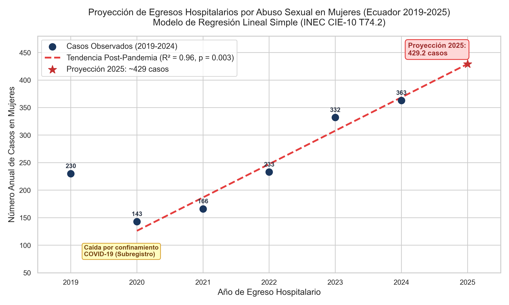
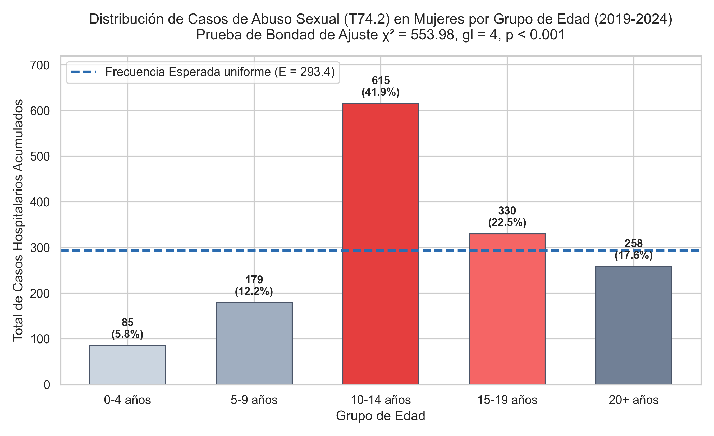
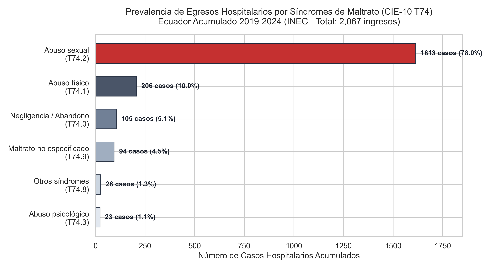
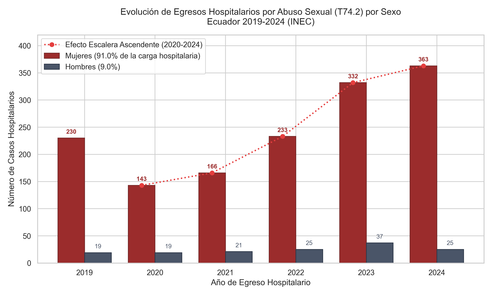
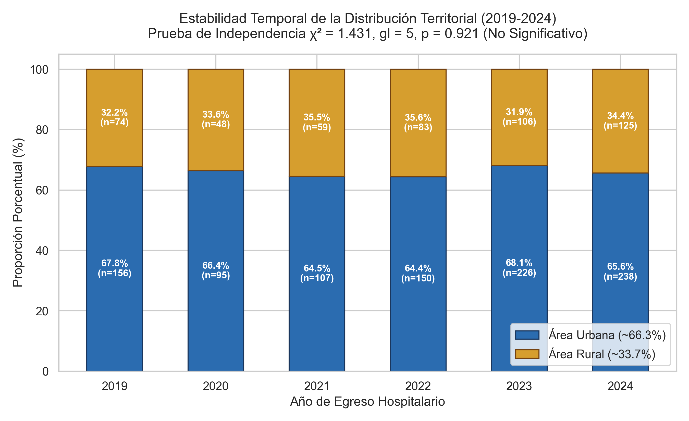

# Violencia sexual contra niñas y adolescentes en Ecuador: Análisis de egresos hospitalarios (2019-2024)

[](https://www.python.org/)
[](https://cloud.google.com/bigquery)
[](LICENSE)

Análisis de datos y modelado estadístico presentado en el **I Congreso Intersectorial sobre Violencia de Género y Mujeres en Situación de Vulnerabilidad** (Loja, Ecuador, diciembre de 2025).

* **Autor:** Pablo Andrés Japón Calva  
* **Presentación:** *Rompiendo el silencio estadístico: Descifrando el patrón de violencia sexual contra niñas y adolescentes en Ecuador a través del análisis de datos*

---

## Descripción del proyecto

Este repositorio contiene las consultas SQL (Google BigQuery) y los scripts en Python utilizados para procesar, analizar y modelar los datos del Registro Estadístico de Egresos Hospitalarios del INEC entre 2019 y 2024 (más de 6 millones de registros).

El objetivo fue identificar patrones demográficos, temporales y geográficos en las hospitalizaciones asociadas a maltrato (CIE-10 T74), con foco en abuso sexual (T74.2), y construir un modelo de regresión lineal para estimar los casos esperados en 2025.

A diferencia de las estadísticas de denuncias judiciales o policiales, los registros hospitalarios reflejan casos donde la agresión requirió internación médica para tratamiento físico, quirúrgico o de emergencia.

---

## Resultados principales

1. **Prevalencia por diagnóstico (CIE-10 T74, 2019-2024):**  
   De los 2,067 ingresos hospitalarios por síndromes de maltrato registrados en el país, el **78.04% (1,613 casos)** correspondió a abuso sexual (`T74.2`), seguido por abuso físico con 9.97% (`T74.1`).

2. **Distribución por sexo:**  
   El **91.0%** de los pacientes hospitalizados por `T74.2` fueron mujeres (1,467 mujeres frente a 146 hombres).

3. **Tendencia anual y proyección para 2025:**  
   * Tras la disminución registrada en 2020 (143 casos en mujeres, atribuible al confinamiento por COVID-19 y subregistro hospitalario), los ingresos aumentaron de forma sostenida: 166 (2021), 233 (2022), 332 (2023) y 363 (2024).
   * La regresión lineal simple para el período 2020-2024 arroja un ajuste de **$R^2 = 0.960$** ($p = 0.0034$), con un incremento promedio de **+60.6 casos por año**.
   * Ecuación: $\text{Casos} = 60.600 \times \text{Año} - 122,285.800$.
   * **Estimación para 2025:** **~429 casos** en mujeres (intervalo de confianza al 95%: $[353.8, 504.6]$).

4. **Concentración por edad:**  
   * Prueba de bondad de ajuste chi-cuadrado: $\chi^2 = 553.98$, $gl = 4$, $p < 0.001$.
   * El grupo de **10 a 14 años** concentra el **41.92% de los casos** (615 de 1,467), con un residuo estandarizado de $+18.78$ respecto a la distribución uniforme esperada.

5. **Distribución territorial y etnia:**  
   * Chi-cuadrado de independencia (rural vs. urbano por año): $\chi^2 = 1.431$, $gl = 5$, $p = 0.921$. La proporción se mantiene estadísticamente constante en el tiempo: **66.3% urbana y 33.7% rural**, consistente con la distribución de población del país.
   * Autoidentificación étnica en mujeres: 81.05% mestiza y 16.29% indígena.
   * A nivel provincial, Tungurahua registró un aumento notorio a partir de 2022, sumándose a provincias con alta carga histórica como Guayas y Morona Santiago.

---

## Gráficos

| Proyección lineal 2025 | Casos por grupo de edad |
| :---: | :---: |
|  |  |

| Diagnósticos de maltrato (CIE-10 T74) | Evolución anual por sexo | Distribución rural vs. urbana |
| :---: | :---: | :---: |
|  |  |  |

---

## Estructura del repositorio

```text
├── sql/
│   ├── 01_etl_normalization/           # Scripts DDL para crear tablas normalizadas en BigQuery (2019-2024)
│   │   ├── 01_etl_egresosnor_2019.sql  # Decodificación de variables numéricas del INEC (2019)
│   │   ├── 02_etl_egresosnor_2020.sql  # Normalización 2020
│   │   ├── 03_etl_egresosnor_2021.sql  # Mapeo de diagnósticos textuales (2021)
│   │   ├── 04_etl_egresosnor_2022.sql  # Normalización 2022
│   │   ├── 05_etl_egresosnor_2023.sql  # Normalización 2023
│   │   └── 06_etl_egresosnor_2024.sql  # Normalización 2024
│   └── 02_analysis/                    # Consultas unificadas para el período 2019-2024
│       ├── 01_prevalencia_sindromes_maltrato_t74.sql
│       ├── 02_tendencia_anual_por_sexo.sql
│       ├── 03_distribucion_etaria_mujeres_t742.sql
│       ├── 04_distribucion_etnica_mujeres_t742.sql
│       ├── 05_distribucion_rural_urbano.sql
│       ├── 06_estacionalidad_mensual.sql
│       └── 07_distribucion_provincial_t742.sql
│
├── src/                                # Scripts de análisis y modelado en Python
│   ├── linear_regression_forecast.py   # Modelo de regresión OLS y proyección 2025
│   ├── inferential_tests.py            # Pruebas chi-cuadrado (edad y residencia)
│   └── plot_prevalence_and_trends.py   # Generación de gráficos en alta resolución
│
├── notebooks/
│   └── 01_analisis_inferencial_y_predictivo.ipynb  # Cuaderno reproducible paso a paso
│
├── data/
│   ├── raw/
│   │   └── diccionario_datos_inec.md   # Esquema y descripción de variables del INEC
│   └── processed/                      # Tablas resumen en formato CSV
│       ├── 01_prevalencia_sindromes_maltrato_2019_2024.csv
│       ├── 02_casos_t742_anuales_por_sexo_2019_2024.csv
│       ├── 03_casos_t742_mujeres_por_grupo_edad.csv
│       ├── 04_casos_t742_mujeres_por_etnia_2019_2024.csv
│       ├── 05_casos_t742_mujeres_rural_urbano_2019_2024.csv
│       └── 06_casos_t742_por_mes_2024.csv
│
├── figures/                            # Gráficos exportados en PNG (300 DPI)
│
└── docs/
    ├── metodologia_investigacion.md    # Detalle metodológico y procesamiento en BigQuery
    └── resultados_inferenciales.md     # Ficha detallada de pruebas estadísticas
```

---

## Cómo ejecutar el proyecto

### 1. Requisitos previos
* Python 3.10 o superior.
* Opcional: Acceso a Google BigQuery si se desea recrear las tablas desde los microdatos originales del INEC.

### 2. Instalación
```bash
git clone https://github.com/Parand1/violencia_sexual_analisis_Ecuador.git
cd violencia_sexual_analisis_Ecuador

python -m venv venv
# Windows:
venv\Scripts\activate
# Linux/Mac:
source venv/bin/activate

pip install -r requirements.txt
```

### 3. Ejecutar los scripts estadísticos
```bash
# Regresión lineal y proyección 2025:
python src/linear_regression_forecast.py

# Pruebas chi-cuadrado (edad y zona rural/urbana):
python src/inferential_tests.py

# Regenerar gráficos en /figures:
python src/plot_prevalence_and_trends.py
```

### 4. Cuaderno Jupyter
```bash
jupyter notebook notebooks/01_analisis_inferencial_y_predictivo.ipynb
```

---

## Referencia

Si utilizas este trabajo o los datos procesados, puedes citarlo como:

```bibtex
@inproceedings{japon2025rompiendo,
  author    = {Jap{\'o}n Calva, Pablo Andr{\'e}s},
  title     = {Rompiendo el silencio estad{\'i}stico: Descifrando el patr{\'o}n de violencia sexual contra ni{\~n}as y adolescentes en Ecuador a trav{\'e}s del an{\'a}lisis de datos},
  booktitle = {I Congreso Intersectorial sobre Violencia de G{\'e}nero y Mujeres en Situaci{\'o}n de Vulnerabilidad},
  year      = {2025},
  month     = {12},
  address   = {Loja, Ecuador},
  url       = {https://github.com/Parand1/violencia_sexual_analisis_Ecuador}
}
```

## Licencia

* Código fuente: [MIT License](LICENSE).
* Datos agregados y documentación: [Creative Commons Attribution 4.0 International (CC BY 4.0)](https://creativecommons.org/licenses/by/4.0/).
