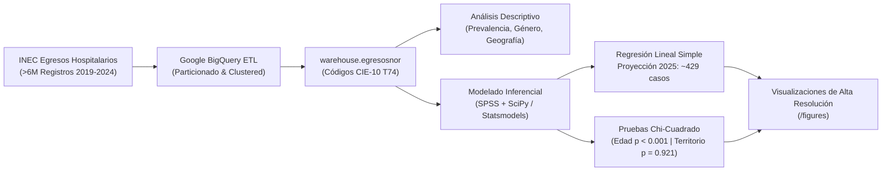

# Rompiendo el Silencio Estadístico: Descifrando el Patrón de Violencia Sexual contra Niñas y Adolescentes en Ecuador a través del Análisis de Datos

[](https://www.python.org/)
[](https://cloud.google.com/bigquery)
[](https://scipy.org/)
[](LICENSE)
[](#contexto-del-congreso-y-autoría)

> **Investigación y Análisis Formal presentado en el:**  
> **I Congreso Intersectorial sobre Violencia de Género y Mujeres en Situación de Vulnerabilidad**  
> *Fecha:* 05 de diciembre de 2025 | Loja, Ecuador  
> *Autor / Investigador:* **Pablo Andrés Japón Calva**  

---

## 📋 Resumen Ejecutivo

Este repositorio alberga la infraestructura completa de análisis de datos, ingeniería de datos en la nube (SQL en Google BigQuery) y modelos estadísticos inferenciales (Python y SPSS) desarrollados para la investigación presentada en el *I Congreso Intersectorial sobre Violencia de Género*.

A partir de la consolidación de **más de 6 millones de registros de egresos hospitalarios** del **Instituto Nacional de Estadística y Censos (INEC)** entre **2019 y 2024**, este trabajo visibiliza la carga clínica de la violencia interpersonal en el sistema de salud ecuatoriano, identificando perfiles demográficos críticos y desarrollando un **modelo predictivo de regresión lineal para el año 2025**.



---

## 🔍 Hallazgos Principales

### 1. Predominancia Abrumadora del Abuso Sexual (78.04%)
Al filtrar la categoría **CIE-10 T74 (Síndromes del maltrato)** en el período 2019–2024 (2,067 ingresos acumulados), el **Abuso Sexual (T74.2)** representa el **78.04% (1,613 casos)** de todas las internaciones hospitalarias, superando por casi 8 a 1 al abuso físico (9.97%).
> *Relevancia clínica:* El egreso hospitalario no refleja meras denuncias, sino casos con lesiones corporales, traumas, necesidad de intervención quirúrgica o profilaxis médica de emergencia.

### 2. Brecha Estructural de Género y "Efecto Escalera" Post-Pandemia
*   **91.0% de los casos corresponden a mujeres** (1,467 mujeres frente a 146 hombres).
*   A partir del año 2020, las admisiones hospitalarias femeninas describen una **escalera ascendente continua año tras año**:
    $$\text{2020: 143} \longrightarrow \text{2021: 166} \longrightarrow \text{2022: 233} \longrightarrow \text{2023: 332} \longrightarrow \text{2024: 363}$$

### 3. Modelo de Regresión Lineal y Proyección 2025
*   **Período Post-Pandemia (2020–2024):** Ajuste extraordinario con **$R^2 = 0.960$** ($96.0\%$ de varianza explicada) y significancia formal de **$p = 0.0034 < 0.01$**.
*   **Tasa de incremento:** $+60.60$ casos anuales adicionales en mujeres ($\beta_1 = 60.600$).
*   **Ecuación del modelo:**
    $$\text{Casos} = 60.600 \times \text{Año} - 122,285.800$$
*   **Proyección 2025:** Se estiman **429 casos** (Intervalo de confianza 95%: $[353.8, 504.6]$). Esto representa prácticamente el **triple** de los ingresos reportados en 2020.
*   *Nota metodológica:* El modelo sobre el período completo 2019-2024 ($R^2 = 0.626, p = 0.061$) evidencia que el confinamiento por COVID-19 en 2020 constituyó una interrupción estructural por subregistro hospitalario.

### 4. Concentración Crítica en Niñas y Adolescentes (10 a 14 años)
*   **Prueba Chi-Cuadrado de Bondad de Ajuste:** $\chi^2 = 553.978$, $gl = 4$, **$p < 0.0001$**.
*   El grupo de **10 a 14 años** concentra **615 casos (41.92% del total)**, con un residuo estandarizado anómalo de **$+18.78$** sobre el valor esperado, definiéndose como la **"Zona de Máximo Riesgo"**.

### 5. Estabilidad Territorial (Espejo Demográfico Nacional)
*   **Prueba Chi-Cuadrado de Independencia:** $\chi^2 = 1.431$, $gl = 5$, **$p = 0.921$** ($p > 0.05$, no significativo).
*   La relación territorial se mantiene constante a lo largo de todos los años: **66.3% en zonas urbanas** y **33.7% en zonas rurales**, demostrando que la violencia no es un fenómeno aislado de un sector, sino transversal y proporcional a la densidad demográfica del Ecuador.
*   **Foco provincial de alerta:** Anomalía en **Tungurahua**, con un crecimiento atípico y acelerado a partir de 2022 que la posicionó entre los primeros lugares nacionales.

---

## 📊 Galería de Evidencia Visual

| Proyección Predictiva 2025 (Regresión OLS) | Distribución de Vulnerabilidad Etaria (Chi² = 553.98) |
| :---: | :---: |
|  |  |

| Prevalencia Síndromes de Maltrato (T74) | Evolución Anual por Sexo ("Efecto Escalera") | Estabilidad Rural vs. Urbana (Chi² = 1.43, p = 0.921) |
| :---: | :---: | :---: |
|  |  |  |

---

## 📁 Estructura del Repositorio

```text
violencia_sexual_analisis_Ecuador/
├── .gitignore                          # Exclusiones de Git
├── LICENSE                             # Licencia de código abierto MIT
├── README.md                           # Documentación principal del proyecto
├── CITATION.cff                        # Archivo formal de citación académica
├── requirements.txt                    # Dependencias científicas de Python
│
├── sql/                                # Scripts SQL optimizados para BigQuery
│   ├── 01_etl_normalization/           # Pipelines ETL de ingestión y normalización
│   │   ├── 01_etl_egresosnor_2019.sql  # Decodificación de variables numéricas INEC 2019
│   │   ├── 02_etl_egresosnor_2020.sql  # Normalización de variables 2020
│   │   ├── 03_etl_egresosnor_2021.sql  # Mapeo de texto y normalización 2021
│   │   ├── 04_etl_egresosnor_2022.sql  # Extracción alfanumérica pura 2022
│   │   ├── 05_etl_egresosnor_2023.sql  # Pipeline estandarizado 2023
│   │   └── 06_etl_egresosnor_2024.sql  # Pipeline estandarizado 2024
│   └── 02_analysis/                    # Consultas unificadas multi-año (2019-2024)
│       ├── 01_prevalencia_sindromes_maltrato_t74.sql
│       ├── 02_tendencia_anual_por_sexo.sql
│       ├── 03_distribucion_etaria_mujeres_t742.sql
│       ├── 04_distribucion_etnica_mujeres_t742.sql
│       ├── 05_distribucion_rural_urbano.sql
│       ├── 06_estacionalidad_mensual.sql
│       └── 07_distribucion_provincial_t742.sql
│
├── src/                                # Código fuente de reproducción estadística en Python
│   ├── linear_regression_forecast.py   # Regresión OLS, cálculo de intervalos y proyección 2025
│   ├── inferential_tests.py            # Pruebas Chi-cuadrado (Bondad de ajuste e Independencia)
│   └── plot_prevalence_and_trends.py   # Generador de gráficos en alta resolución (DPI=300)
│
├── notebooks/                          # Cuaderno de análisis interactivo
│   └── 01_analisis_inferencial_y_predictivo.ipynb
│
├── data/                               # Diccionarios y datos consolidados anonimizados
│   ├── raw/
│   │   └── diccionario_datos_inec.md   # Metadatos, esquemas y tablas de códigos INEC
│   └── processed/                      # Datasets estructurados en formato CSV
│       ├── 01_prevalencia_sindromes_maltrato_2019_2024.csv
│       ├── 02_casos_t742_anuales_por_sexo_2019_2024.csv
│       ├── 03_casos_t742_mujeres_por_grupo_edad.csv
│       ├── 04_casos_t742_mujeres_por_etnia_2019_2024.csv
│       ├── 05_casos_t742_mujeres_rural_urbano_2019_2024.csv
│       └── 06_casos_t742_por_mes_2024.csv
│
├── figures/                            # Gráficos en formato PNG de alta resolución (DPI=300)
│   ├── prevalencia_sindromes_maltrato_t74.png
│   ├── brecha_genero_escalera_2019_2024.png
│   ├── regresion_lineal_proyeccion_2025.png
│   ├── distribucion_etaria_mujeres_chi2.png
│   └── estabilidad_rural_urbana_chi2.png
│
└── docs/                               # Documentación técnica y metodológica extendida
    ├── metodologia_investigacion.md    # Arquitectura en la nube y consideraciones éticas
    └── resultados_inferenciales.md     # Fichas estadísticas detalladas y contrastes de hipótesis
```

---

## 🚀 Guía de Reproducción Rápida

### 1. Clonar el repositorio
```bash
git clone https://github.com/Parand1/violencia_sexual_analisis_Ecuador.git
cd violencia_sexual_analisis_Ecuador
```

### 2. Configurar entorno Python e instalar dependencias
```bash
python -m venv venv
# En Windows:
venv\Scripts\activate
# En Linux/Mac:
source venv/bin/activate

pip install -r requirements.txt
```

### 3. Ejecutar análisis estadístico y generar gráficos
```bash
# Ejecutar modelo de regresión lineal y proyección 2025:
python src/linear_regression_forecast.py

# Ejecutar pruebas Chi-Cuadrado de hipótesis:
python src/inferential_tests.py

# Generar gráficos de prevalencia y tendencias:
python src/plot_prevalence_and_trends.py
```

### 4. Explorar el Cuaderno Interactivo
Puedes iniciar Jupyter Notebook para explorar interactivamente las pruebas y predicciones:
```bash
jupyter notebook notebooks/01_analisis_inferencial_y_predictivo.ipynb
```

---

## 📌 Contexto del Congreso y Autoría

*   **Investigador Principal:** Pablo Andrés Japón Calva
*   **Evento:** *I Congreso Intersectorial sobre Violencia de Género y Mujeres en Situación de Vulnerabilidad*
*   **Fecha:** 05 de diciembre de 2025
*   **Afiliación:** Loja, Ecuador
*   **ORCID:** [0009-0005-7798-2516](https://orcid.org/0009-0005-7798-2516)

### Cómo Citar este Trabajo

#### Formato BibTeX:
```bibtex
@inproceedings{japon2025rompiendo,
  author    = {Jap{\'o}n Calva, Pablo Andr{\'e}s},
  title     = {Rompiendo el silencio estad{\'i}stico: Descifrando el patr{\'o}n de violencia sexual contra ni{\~n}as y adolescentes en Ecuador a trav{\'e}s del an{\'a}lisis de datos},
  booktitle = {I Congreso Intersectorial sobre Violencia de G{\'e}nero y Mujeres en Situaci{\'o}n de Vulnerabilidad},
  year      = {2025},
  month     = {12},
  address   = {Loja, Ecuador},
  url       = {https://github.com/Parand1/violencia_sexual_analisis_Ecuador}
}
```

#### Formato APA (7ª ed.):
> Japón Calva, P. A. (2025, 5 de diciembre). *Rompiendo el silencio estadístico: Descifrando el patrón de violencia sexual contra niñas y adolescentes en Ecuador a través del análisis de datos* [Presentación de conferencia]. I Congreso Intersectorial sobre Violencia de Género y Mujeres en Situación de Vulnerabilidad, Loja, Ecuador. https://github.com/Parand1/violencia_sexual_analisis_Ecuador

---

## 📄 Licencia

Este proyecto está distribuido bajo la licencia **MIT License** para el código fuente y **Creative Commons Attribution 4.0 International (CC BY 4.0)** para la documentación y datos agregados. Consulte el archivo [LICENSE](LICENSE) para más detalles.
